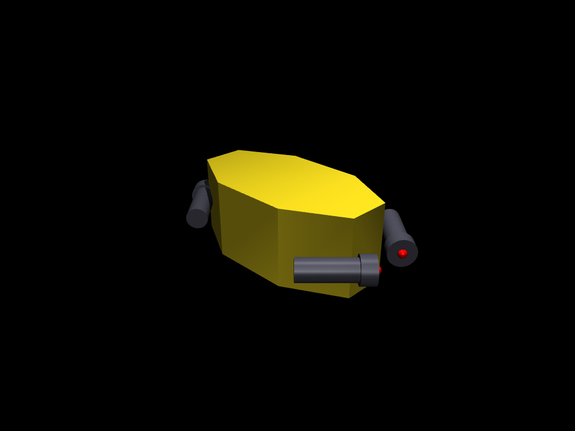

# umiusi_sim

MuJoCo simulation + reinforcement learning for the **UMIUSI** azimuth-thruster underwater robot.

It simulates each thruster's **servo drive** (azimuth angle) and **thruster output** (ESC command → thrust) with an
explicit **analytical hydrodynamic model** (buoyancy, drag, added mass). It trains policies for attitude hold and
attitude + direction cruise, and — toward the target competition — hosts a **balloon-popping scenario** that runs
end-to-end (drive the world, pop balloons, score) with onboard cameras and an analytical feed-forward controller.

- **Training** depends only on Python (MuJoCo + Gymnasium + Stable-Baselines3 + PyTorch) — **no ROS 2 required**.
- A thin **ROS 2 bridge** (under `ros2_ws/`) is planned only for evaluation / sim-to-real, reusing the existing
  `sinsei_umiusi_control` interfaces.

Design rationale and architecture notes are maintained as separate working docs outside this
repository; this README plus code comments are the in-repo reference.



---

## Status

| Phase | What | State |
| ----- | ---- | ----- |
| 0 | Project spec, architecture, ROS metapackage | ✅ done |
| 1 | `umiusi_sim/` — MJCF model + analytical physics + simulator API | ✅ done |
| 2 | `tools/validate_sim.py` — simulator validation (gate before RL) | ✅ done (10/10) |
| 3 | `umiusi_rl/` — Gymnasium env + PPO training + eval | ✅ done — attitude hold + direction cruise + disturbance/sim2real robustness |
| 5a | Competition sim: balloon world + cameras + analytical FF driver, runnable & scoring (no RL) | ✅ done |
| 5b | Perception (camera → balloon detect) + behavior FSM (autonomy), Pi 4 deploy | 🟡 next |
| 4 | `ros2_ws/` — ROS 2 bridge: custom MuJoCo `ros2_control` hardware plugin; the real controllers + an RL policy drive the sim | ✅ done (in the sibling `ros2_ws/`) |

---

## Repository layout

```
mujoco_ws/                # workspace container (NOT version-controlled)
  umiusi_sim/             # ← THIS git repo (monorepo: two installable packages under src/)
    src/
      umiusi_sim/           # PACKAGE 1: reusable simulator (no ROS, no RL) — usable by other robots/tasks
        simulator.py        #   UmiusiSimulator: reset() / step(action) / render_camera()
        control.py          #   analytical feed-forward allocation (AttitudeController port, no learning)
        physics/            #   analytical hydrodynamics + thruster model
        description/        #   robot description: umiusi.xml (MJCF) + onboard cameras
          scenarios/        #     composed worlds (MjSpec) — competition_balloon.py (pool+balloons+pin)
      umiusi_rl/            # PACKAGE 2: RL experiments (depends on umiusi_sim)
        envs/umiusi_pose_env.py #   UmiusiPoseEnv: attitude / depth / pose / attitude_velocity
        train.py  eval.py   #   PPO default (--algo sac/td3); models/ is gitignored
    configs/                # umiusi.yaml (physics) + train_ppo.yaml (env/reward/algo)
    tools/                  # validate_sim, drive, snapshot, camera_demo, scenario_demo, competition_run, analyze_steady
    examples/               # pretrained example policies (cruise_policy/) so eval/drive run out of the box
    media/                  # rendered placement screenshots
    pyproject.toml  uv.lock # uv-managed deps (CPU torch pinned); reproducible via `uv sync`
    # local-only (gitignored / outside the repo): models/ (trained policies), umiusi_model/ (CAD provenance),
    # and the ~/mujoco_ws/ai/ working docs (project_spec, architecture, sim_spec) kept beside the repo.
  ros2_ws/                 # separate ROS 2 workspace (bridge, later phases; its own repo when needed)
```

The split keeps the **reusable simulation** (`umiusi_sim`) independent of the **RL experiments**
(`umiusi_rl`): `umiusi_rl` imports `umiusi_sim` as a library. If a second consumer appears (e.g. a
perception / Pi 4 stack), `umiusi_sim` can be promoted to its own repo consumed via a normal
`pip install` git dependency with no churn to the import paths.

---

## Setup

WSL Ubuntu 24.04, Python ≥3.10, CPU-only. ROS 2 is **not** needed for the simulation/RL.

The project uses [**uv**](https://docs.astral.sh/uv/) — one command builds a reproducible virtual
environment from `pyproject.toml` + `uv.lock` (CPU-only torch is pinned, so no CUDA download).

```bash
# 1. system deps (MuJoCo GUI + video encoding)
sudo apt update && sudo apt install -y build-essential libglfw3 libglfw3-dev ffmpeg

# 2. install uv (once)
curl -LsSf https://astral.sh/uv/install.sh | sh

# 3. create the environment (installs both packages editable + all deps)
cd ~/mujoco_ws/umiusi_sim
uv sync --extra dev
```

Run any command with `uv run` (it uses the managed `.venv` automatically), e.g.
`uv run python -m tools.validate_sim`. All commands below assume the repo root
(`~/mujoco_ws/umiusi_sim`); drop the `uv run` prefix if you `source .venv/bin/activate` first.

---

## Usage

All commands run from the repo root (`~/mujoco_ws/umiusi_sim`) through **uv**: either prefix each with
`uv run` (e.g. `uv run python -m tools.validate_sim`), or `source .venv/bin/activate` once and drop it.
The examples below omit the `uv run` prefix for brevity.

### Display & rendering (read once — the whole rule)

MuJoCo renders one of two ways; choose per command:

| Mode | Use it for | How | Applies to |
| --- | --- | --- | --- |
| **Interactive GUI** (live window) | watching it move | needs a display (WSLg on Win 11); **do NOT set `MUJOCO_GL`** | `tools.drive`, any `--render` |
| **Headless / offscreen** (save PNG/MP4, or no display) | saving images/video, headless boxes | prefix the command with **`MUJOCO_GL=egl`** | `tools.snapshot`, `camera_demo`, `scenario_demo`, any `--record` |

That's it: `MUJOCO_GL=egl` is **only** for offscreen capture — setting it breaks the live viewer, and
omitting it on a headless machine makes offscreen rendering fail. Every command below follows this rule.

**Free camera (GUI only):** the viewer opens on a fixed, well-framed camera. Press `[` / `]` in the
window to cycle cameras; the **free** camera is the only mouse-controllable one (left-drag orbit,
right-drag pan, scroll zoom) — start on it with `--free`. It assumes Z-up while the model is Y-up, so it
looks tilted; that's why the defaults and snapshots use the fixed cameras.

---

### Simulator — `umiusi_sim`

**Validate** (physics gate — run before trusting anything; keep it green):
```bash
python -m tools.validate_sim        # PASS/FAIL gate (10 checks); exit 1 on any failure
python -m tools.validate_sim -v     # + per-thruster detail and calibration numbers
```
Covers buoyancy float/sink, self-leveling, drag, per-thruster thrust direction, servo tracking + tilt,
feed-forward allocation (heave/surge decoupling), and open-loop stability. Headless.

The interactive GUI is **`tools.drive`** — load a trained policy and steer it from the keyboard (like a
vehicle) in the legible default world (checker floor grid + axis triad). It and the `--render` flags all
share one viewer module (`umiusi_sim.viewer`): default fixed **track** camera that follows the vehicle;
`[` / `]` cycle cameras; the free camera is mouse-controllable but looks tilted (the model is +Y-up — the
fixed cameras are correct). GUI needs a display, no `MUJOCO_GL`.

```bash
python -m tools.drive --model examples/cruise_policy/final.zip           # W/S fwd/back, A/D strafe, Q/E turn, R/F tilt, Space stop
python -m tools.drive --model examples/cruise_policy/final.zip --headless 150   # headless self-test (forward → cosine ~1)
```
A pretrained cruise policy ships in [`examples/`](examples/) so `drive` / `eval` work right after cloning
(no training needed). Press **Space** to stop the cruise command and just watch it hold in place.

To watch a *specific* automated run live instead, pass `--render` to it (`eval --render`,
`competition_run --render`); training is headless (watch curves in tensorboard, then `eval --render`).
A standalone rviz-style viewer that attaches to a separately-running sim is a possible future addition
(it would need an IPC layer since the sim isn't ROS-based) — see the Roadmap.

**Onboard cameras** — two fixed cameras move with the vehicle: `front_cam` (+X, forward) and `down_cam`
(nadir, −Y). `UmiusiSimulator.render_camera(camera, w, h)` returns an `(H, W, 3)` uint8 RGB frame:
```bash
MUJOCO_GL=egl python -m tools.snapshot          # media/umiusi_{iso,top,front,corner}.png
MUJOCO_GL=egl python -m tools.camera_demo [out] # capture a front_cam frame (default ./front_cam.png)
```

**Competition simulation** (balloon-popping, no RL) — a composed world (3.3 m pool + tethered balloons
**red @0.5 m +30 / yellow @1.5 m +10 / blue @0.7 m −10 decoy** + a pin), driven by the analytical
feed-forward controller (`umiusi_sim.control`, a port of the real AttitudeController allocation):
```bash
MUJOCO_GL=egl python -m tools.scenario_demo                 # render the world (front/down cams)
MUJOCO_GL=egl python -m tools.competition_run --seconds 40  # drive, pop, score, write an mp4 (--record <p> --seed <n>)
python -m tools.competition_run --render                    # or watch it live (GUI, no MUJOCO_GL)
python -m umiusi_sim.control                                # feed-forward allocation self-test
```
It seeks the nearest positive-value balloon (avoids targeting blue), detects pops geometrically (pin tip
vs balloon), and prints a pop timeline + final score (typically 80). The world is composed with
`mujoco.MjSpec` and does **not** touch the base model, so `validate_sim` stays green. Perception + a
behavior FSM replace the ground-truth driver in the next phase.
> The feed-forward allocation's axes don't line up 1:1 with the sim (empirically `Vx→−X`, `Vz→+Y`,
> `Vy→yaw couple`) — documented in `control.py`; reconcile before driving the sim from real `ros2_control`.

**From Python:**
```python
import numpy as np
from umiusi_sim.simulator import UmiusiSimulator

sim = UmiusiSimulator()                 # loads description/umiusi.xml + configs/umiusi.yaml
sim.reset(pos=(0.0, 0.5, 0.0))          # +Y is up
for _ in range(100):                    # action = [servo_1..4, esc_1..4], each in [-1, 1]
    state = sim.step(np.array([0, 0, 0, 0,  0.5, 0.5, 0.5, 0.5]))
print(state["pos"], state["quat"], state["lin_vel"], state["servo"], state["thrust"])
```
Physics-loop smoke test: `python -m umiusi_sim.simulator`.

---

### Reinforcement learning — `umiusi_rl`

Four selectable **tasks** (`--task`), each matched to a realistic (cheap) sensor suite. Reward and
success always use the true state, so a limited sensor suite just leaves part of the task unobservable.
Training is CPU-only and scales with the number of parallel environments (`--n-envs`).

| `--task` | goal | sensor suite (default `obs_mode`) | notes |
| --- | --- | --- | --- |
| `attitude` | track a random target **orientation** | AHRS, e.g. BNO055 (`imu`) | horizontal & depth drift (unobserved) |
| `attitude_depth` | random orientation **+ depth** | AHRS + pressure/depth (`imu_depth`) | horizontal drifts |
| `attitude_velocity` | hold orientation **+ cruise in a commanded direction** | AHRS + body-frame velocity command (`imu`) | **direction-only** (speed magnitude unobservable without a DVL) |
| `pose` | go-to-pose: random **position** (upright) | AHRS + depth + DVL + position (`full`) | needs a position reference |

**Train:**
```bash
python -m umiusi_rl.train --task attitude          --run-name att       --n-envs 12   # AHRS only
python -m umiusi_rl.train --task attitude_velocity --run-name cruise    --n-envs 12   # hold + direction cruise (auto-curriculum)
python -m umiusi_rl.train --task attitude_velocity --run-name cruise_dr --disturb --domain-rand   # + disturbances + sim2real DR
python -m umiusi_rl.train --task pose --obs-mode imu_depth_dvl --run-name pose_dvl    # DVL velocity, no abs. XZ
python -m umiusi_rl.train --algo sac --task attitude                                  # switch algorithm
```
`--disturb` = per-episode water current + force impulses; `--domain-rand` = randomize buoyancy/thrust/drag
+ observation noise + a 1-step control→actuation latency (sim2real). Both are recorded in `meta.yaml`.

**Evaluate / watch** (`eval` reloads task + sensor suite + disturbance/DR from `meta.yaml`, so it matches training):
```bash
tensorboard --logdir models/cruise/tb                                                     # training curves
python -m umiusi_rl.eval --model models/cruise/final.zip                                   # headless metrics
python -m umiusi_rl.eval --model models/cruise/final.zip --render                          # watch live (GUI, no MUJOCO_GL)
MUJOCO_GL=egl python -m umiusi_rl.eval --model models/cruise/final.zip --record out.mp4    # save a video
python -m umiusi_rl.eval --model models/cruise/final.zip --no-disturb                      # isolate the policy's own steadiness
python -m umiusi_rl.eval --model models/cruise/final.zip --domain-rand                     # stress-test under model mismatch
```
`eval` reports mean angular velocity (cruise wobble), speed-along-command, sideways drift, thrust use, and
servo motion. An RGB axis-triad marker shows the commanded orientation; `--render`/`--record` use a
tracking camera that follows the vehicle (attitude/attitude_velocity tasks don't hold horizontal position,
so it holds its commanded attitude while drifting — expected, sensor-limited behavior).

Reward weights, ranges, tolerances, and PPO hyperparameters live in
[`configs/train_ppo.yaml`](configs/train_ppo.yaml); checkpoints, tb logs, and the final policy go to the
gitignored `models/<run-name>/`.

**Sensor note:** underwater there is no GPS, so horizontal position (X, Z) is only observable in `full`.
A 9-DOF AHRS (BNO055) gives absolute orientation incl. magnetometer heading (cheap → attitude tasks are
well-posed); a pressure sensor gives depth; a DVL gives body velocity (drift/current rejection without an
absolute position). `imu`/`imu_depth` therefore cannot hold horizontal position.

---

## Roadmap & current limitations

**What works today** (standalone Python, CPU): the analytical simulator + validation gate, the four RL
tasks with trained attitude-hold and attitude+direction-cruise policies (incl. disturbance + light
sim2real domain randomization), onboard cameras, the competition balloon-popping scenario running
end-to-end with the analytical feed-forward driver + scoring, a unified live viewer with a legible
default world, an interactive drive tool (steer a trained policy from the keyboard), and a classical-CV
balloon detector (colour + bearing + range from the onboard camera).

**Not supported yet:**
- **ROS 2 integration — done** (in the sibling `ros2_ws/`, not this repo). A custom MuJoCo
  `ros2_control` hardware plugin (`umiusi_sim_bridge`) runs the analytical hydro at 100 Hz, so the REAL
  `sinsei_umiusi_control` controllers drive the sim unchanged (swap the plugin for CAN to deploy). A
  trained RL policy can also drive it as the low-level controller over the thruster direct-override
  path (`tools/ros_policy.py`), and `tools/ros_view.py` renders it live (both over rosbridge). The
  community `mujoco_ros2_control` was ruled out (joint/sensor interfaces only, not our ESC/servo GPIO
  + site-force actuation + analytical hydro). Remaining: aarch64 MuJoCo for the Pi; FF-frame sign reconcile.
- **3-D depth-holding locomotion.** The trained low-level cruise is orientation + *horizontal* direction
  only. The final drivetrain wants orientation + depth-hold + horizontal cruise, but the depth-sensor
  choice isn't fixed yet, so that training is on hold. (The env already supports a 3-D velocity command
  via `vel_cmd_horizontal: false`.)
- **Perception.** On the **sim** scene, classical colour detection is done (`tools.perception_demo`,
  `umiusi_sim.perception`, `uv sync --extra perception`: colour + bearing + range, ~100%). On **real
  underwater images** classical CV hits a recall wall (red attenuates to near-invisible, blue ≈ pool
  water); colour + a Hough-circle shape pass cut the false-positive flood but can't recover red. A
  **learned tiny-CNN detector** (`umiusi_sim.perception.learned_detector`, `tools.perception_train` /
  `perception_bench`, `uv sync --extra learn`) breaks that wall — a 40-image baseline lifts red recall
  0.00→0.82, blue→0.63 — and is **Pi-4-safe** (int8 ONNX, ~12–30 fps @320px projected). An
  **underwater colour-restoration** preprocess (`perception.underwater`, `tools.underwater_correct`:
  red-channel compensation + white balance + CLAHE) recovers red-vs-blue — the hardest real-world
  ambiguity, since deep red attenuates to look blue — for both labelling and detector input. Synthetic
  data: `tools.gen_sim_dataset` renders the balloon scene, applies a physically-based underwater
  degradation (`perception.underwater_sim`: depth-based colour attenuation + backscatter haze +
  turbidity + surface reflection, domain-randomised), and auto-labels balloons from the segmentation
  buffer — free perfectly-labelled data to pretrain on + a hard, difficulty-dialable eval set. Next: more
  labelled frames, then the final int8 export + a real Pi 4 benchmark.
- **Autonomy (behavior FSM).** The remaining piece is a behavior FSM (search → approach → ram →
  reacquire) consuming detections to replace `competition_run`'s ground-truth driver, plus multi-frame
  tracking. The feed-forward frame mapping (`Vx→−X` etc., see `control.py`) still needs reconciling.
- **Decoupled viewer — done (ROS path).** For the standalone Python sim, `tools.drive` / `--render`
  each launch their own in-process viewer. An rviz-style viewer that attaches to a *separately-running*
  sim now exists once the ROS bridge is up: the C++ `MujocoSystem` plugin publishes the MuJoCo `qpos`,
  and `tools/ros_view.py` (`uv sync --extra viz`) renders it over **rosbridge** via `roslibpy` (no rclpy).
- **Sim-to-real + Pi 4 deploy.** Domain-randomization hooks exist; on-hardware tuning is future.

**Planned order:** perception + behavior FSM (phase 5b; a learned detector for the real-image recall wall) →
depth-sensor decision + 3-D depth-hold locomotion → sim-to-real / Pi 4 deploy (aarch64 MuJoCo). ROS 2 bridge
(phase 4) is done. See the Status table above.

---

## Configuration

All physical parameters live in [`configs/umiusi.yaml`](configs/umiusi.yaml): water density / displaced volume /
buoyancy offset, diagonal linear+quadratic drag, added mass (off by default), thrust map, servo range/slew, and the
measured hull mass/CoM/inertia. The drag coefficients are still `PLACEHOLDER`; `displaced_volume` and the thrust map
are first estimates pending hardware confirmation. `validate_sim -v` prints calibration numbers for these.

The robot geometry lives in [`src/umiusi_sim/description/umiusi.xml`](src/umiusi_sim/description/umiusi.xml). It is intentionally coarse
(octagonal-prism hull + T-shaped azimuth thrusters + two onboard cameras) for speed; **dynamics use the
measured mass/inertia**, not the coarse shapes.

**Coordinate frame:** the CAD frame with **+Y up** (the 4 thrusters lie in the X-Z plane). Gravity is `(0, -9.81, 0)`.

**Assumptions to verify against hardware** (see the notes in `configs/umiusi.yaml`): servo rotation axis = +Y, thrust
direction = each thruster's local +X, mounting neutral angles, and the id↔`lf/lb/rb/rf` mapping.

---

## Notes for regenerating the model from CAD

The measured data is in `umiusi_model/` (Fusion 360 export: `STL/` + `description/` mass & placement notes). The raw
`base_link.stl` has ~1.08M triangles (over MuJoCo's 200k limit), so the model uses primitives instead of the mesh.
`tools/decimate_mesh.py` can produce a low-poly STL if you later want a mesh visual.
